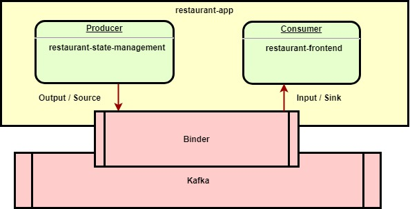
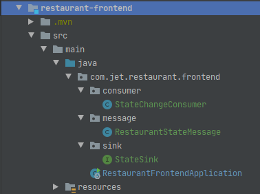
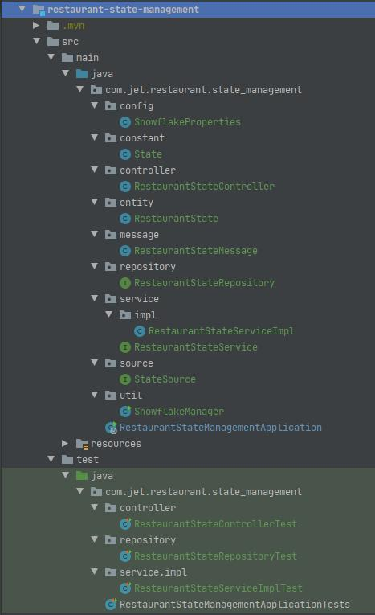
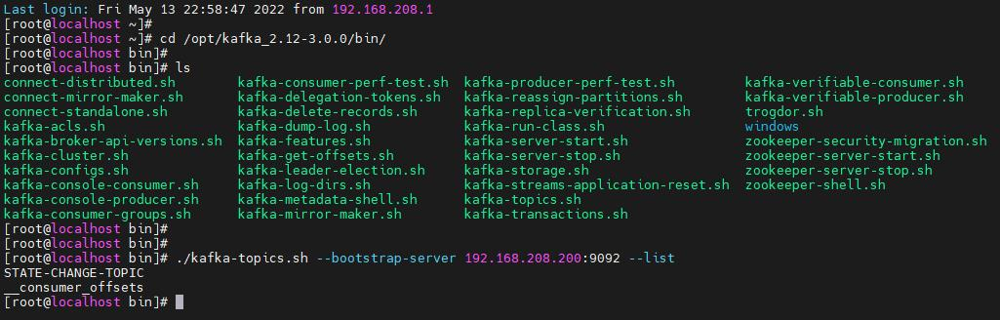
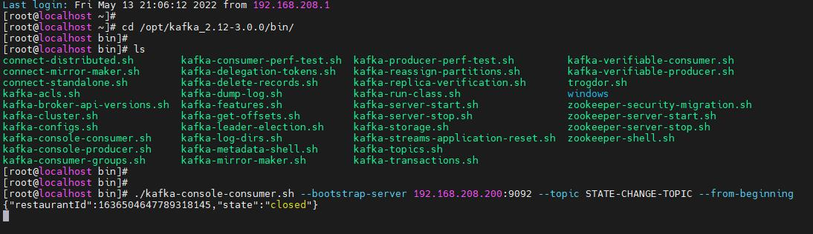
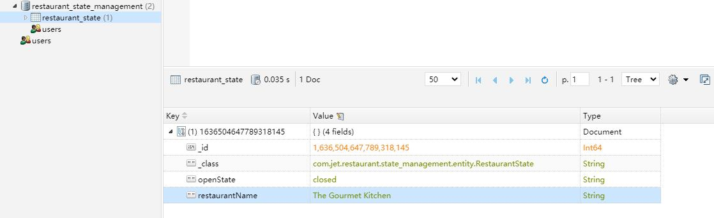

# restaurant-app

Hi, thank you so much for taking your time to review my solution, I truly appreciate it :)

This project is built based on microservice architecture, where two services included:

- restaurant-state-management

- restaurant-frontend

These two services communicate with each other through `Spring Cloud Stream` based on `Kafka`.

The restaurant-state-management service acts as the producer while the restaurant-frontend service acts as the consumer.

## Work Flow

- For each restaurant, its state is stored in `MongoDB` in the form of `RestaurantState`  object.

- The state can be updated by `updateRestaurantState()` method and be retrieved by `getRestaurantState()` method in `RestaurantStateController`.

- When a request for updating state is send to `RestaurantStateController`, the code checks if the state passed in is the same as the current state. If it is, return `ok` without doing anything else. If it isn't, it then updates the state and sends a message to restaurant-frontend service.

## Project Structure

(For saving time, I only write tests for restaurant-state-management service.)

## Work Results

The consumer received the message for state changing.

The state is changed from *open* to *closed*.

